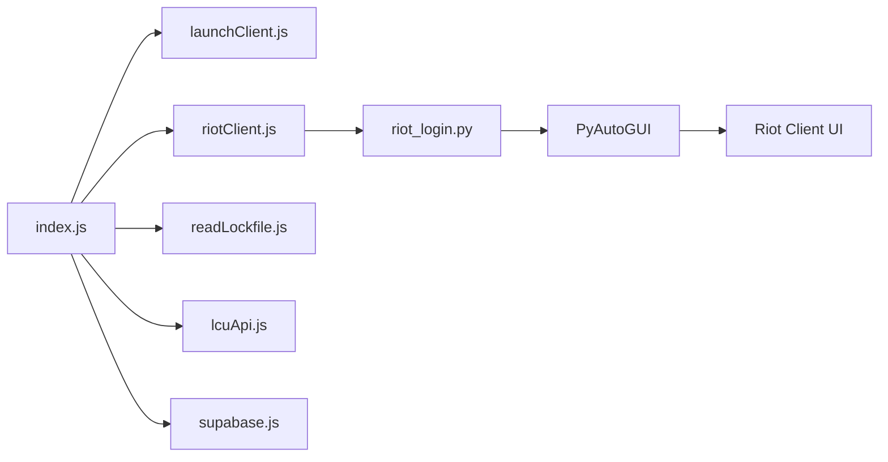

# Shop Scraper - League of Legends

Scraper automatizado de skins rebajadas de League of Legends usando la LCU API (League Client Update API).

## Características

- 🤖 **Automatización completa**: Lanza el cliente, inicia sesión y obtiene datos automáticamente
- 🖼️ **Detección de imágenes**: Usa PyAutoGUI para automatizar el login sin depender de coordenadas fijas
- 🔄 **Arquitectura híbrida**: JavaScript para orquestación y APIs, Python para automatización UI
- 📊 **Integración con Supabase**: Almacena automáticamente las ofertas en la base de datos
- 🛡️ **Robusto**: Manejo de errores, reintentos y timeouts configurables

## Requisitos

### Software necesario

- **Node.js** 18.0.0 o superior
- **Python** 3.8 o superior
- **League of Legends** instalado
- **Riot Client** instalado

### Cuentas y servicios

- Cuenta de Riot Games
- Proyecto de Supabase configurado con tabla `skin_sales`

## Instalación

### 1. Clonar o descargar el proyecto

```bash
cd shop-scraper
```

### 2. Instalar dependencias de Node.js

```bash
npm install
```

### 3. Instalar dependencias de Python

```bash
npm run install:python
```

O manualmente:

```bash
pip install -r requirements.txt
```

### 4. Configurar variables de entorno

Crea un archivo `.env` en la raíz del proyecto:

```env
# Supabase
SUPABASE_URL=https://tu-proyecto.supabase.co
SUPABASE_KEY=tu-clave-anon-publica

# Riot Games
RIOT_USERNAME=tu_usuario
RIOT_PASSWORD=tu_contraseña

# Rutas (opcional, usa estos valores por defecto)
RIOT_CLIENT_PATH=C:/Riot Games/Riot Client/RiotClientServices.exe
LOL_INSTALL_PATH=C:/Riot Games/League of Legends
```

### 5. Preparar imágenes de referencia

**IMPORTANTE**: Debes capturar screenshots de los elementos del Riot Client para que la automatización funcione.

1. Abre el Riot Client manualmente
2. Captura las siguientes imágenes usando la Herramienta de Recortes (Win + Shift + S):
   - `assets/username_field.png` - Campo de usuario
   - `assets/password_field.png` - Campo de contraseña
   - `assets/jugar_button.png` - Botón "Jugar" (después del login)
   - `assets/login_button.png` - Botón de login (opcional)

3. Guarda las imágenes en la carpeta `assets/` con los nombres exactos indicados

Ver [`assets/README.md`](assets/README.md) para instrucciones detalladas.

## Uso

### Ejecución básica

```bash
npm start
```

### Probar solo el script de Python

```bash
python src/riot_login.py "tu_usuario" "tu_contraseña"
```

## Flujo de ejecución

1. **Lanzamiento**: Ejecuta `RiotClientServices.exe` con los parámetros para League of Legends
2. **Login automatizado**: Python detecta los campos y botones usando las imágenes de referencia
3. **Espera del lockfile**: Monitorea el archivo `lockfile` que contiene las credenciales de la LCU API
4. **Consulta LCU API**: Obtiene los datos de la tienda (`/lol-store/v1/featured`)
5. **Extracción de datos**: Filtra las skins en oferta
6. **Almacenamiento**: Hace upsert en Supabase

## Estructura del proyecto

```
shop-scraper/
├── assets/                    # Imágenes de referencia para PyAutoGUI
│   ├── username_field.png
│   ├── password_field.png
│   ├── jugar_button.png
│   └── README.md
├── src/
│   ├── index.js              # Orquestador principal
│   ├── launchClient.js       # Lanza el Riot Client
│   ├── riotClient.js         # Llama al script Python
│   ├── riot_login.py         # Automatización UI con PyAutoGUI
│   ├── readLockfile.js       # Lee credenciales de LCU
│   ├── lcuApi.js             # Cliente HTTP para LCU API
│   └── supabase.js           # Cliente de Supabase
├── .env                       # Variables de entorno (no incluido)
├── package.json
├── requirements.txt           # Dependencias Python
└── README.md
```

## Arquitectura



## Troubleshooting

### El script Python no encuentra las imágenes

1. Verifica que las imágenes estén en `assets/` con los nombres correctos
2. Asegúrate de capturar las imágenes en la misma resolución donde ejecutas el script
3. Ajusta el valor de `CONFIDENCE` en `riot_login.py` (prueba con 0.7 o 0.75)

### Error: "Python no encontrado"

1. Verifica que Python esté instalado: `python --version`
2. Si usas `python3`, modifica `riotClient.js` línea 9: `spawn('python3', ...)`
3. Añade Python a la variable PATH del sistema

### Error: "No se encontró la ventana del Riot Client"

1. Asegúrate de que el Riot Client se haya abierto correctamente
2. Verifica que la ventana tenga el título "Riot Client"
3. Aumenta el timeout en `riot_login.py` (variable `timeout` en `find_riot_window()`)

### La LCU API no responde

1. Verifica que League of Legends haya iniciado completamente
2. Aumenta `MAX_RETRIES` en `lcuApi.js`
3. Revisa que el lockfile exista en la ruta configurada

## Configuración avanzada

### Ajustar timeouts

Edita las constantes en `src/riot_login.py`:

```python
LOGIN_WAIT_SECONDS = 10          # Espera inicial para pantalla de login
POST_LOGIN_WAIT_SECONDS = 15     # Espera después de enviar credenciales
IMAGE_SEARCH_TIMEOUT = 10        # Tiempo máximo para encontrar cada imagen
CONFIDENCE = 0.8                 # Confianza de detección (0.7-0.9)
```

### Modo debug

Para ver screenshots cuando falla la detección, modifica `riot_login.py` y añade:

```python
pyautogui.screenshot('debug_screenshot.png')
```

## Seguridad

- ⚠️ **Nunca** compartas tu archivo `.env`
- ⚠️ Las credenciales se pasan como argumentos al script Python (visibles en el administrador de procesos)
- ⚠️ Usa una cuenta secundaria si es posible
- ⚠️ Este proyecto es solo para uso educativo

## Limitaciones

- Solo funciona en Windows (usa `pygetwindow` y el Riot Client es Windows-only en esta implementación)
- Requiere que el Riot Client esté visible (no minimizado)
- La detección de imágenes depende de la resolución y escala de DPI
- No funciona con autenticación de dos factores (2FA)

## Contribuir

Las contribuciones son bienvenidas. Por favor:

1. Haz fork del proyecto
2. Crea una rama para tu feature (`git checkout -b feature/amazing-feature`)
3. Commit tus cambios (`git commit -m 'Add amazing feature'`)
4. Push a la rama (`git push origin feature/amazing-feature`)
5. Abre un Pull Request

## Licencia

Este proyecto es de código abierto y está disponible bajo la licencia MIT.

## Disclaimer

Este proyecto no está afiliado, asociado, autorizado, respaldado por, o de ninguna manera oficialmente conectado con Riot Games, Inc., o cualquiera de sus subsidiarias o afiliadas.

League of Legends y Riot Games son marcas registradas de Riot Games, Inc.

El uso de este software es bajo tu propio riesgo. Los autores no se hacen responsables de cualquier daño o violación de los términos de servicio.
